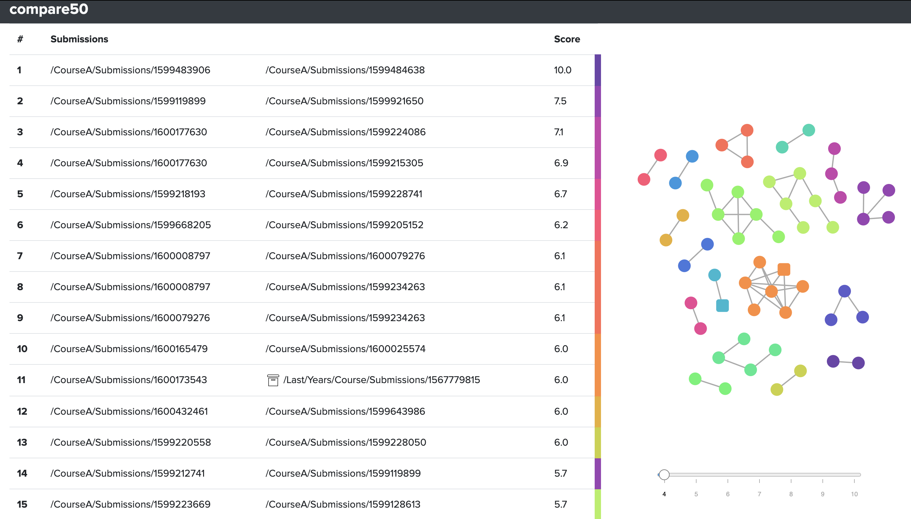
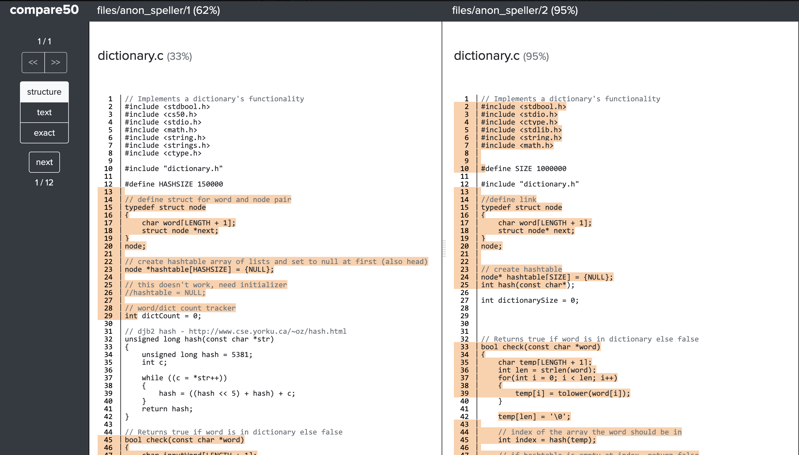

``compare50``
=============

.. toctree::
   :hidden:
   :maxdepth: 3
   :caption: Contents:

   api

.. Indices and tables
.. ==================

.. * :ref:`genindex`
.. * :ref:`api`
.. * :ref:`modindex`
.. * :ref:`search`

.. code-block:: bash

    compare50 course/submission/* -a last/years/submissions/* -d distro/code/*

|index_pic| |match_pic|

compare50 is a tool for detecting similarity in code that supports well over 300 programming and templating languages. The tool itself is open-source and by design extensible in its comparison methods. There is no need to upload code to an external host, compare50 runs locally from the command-line. As a local tool, compare50 presents its findings in static and interactive HTML files that allow for easy sharing. And it does so blazingly fast, easily comparing 1000s of source files within seconds.

Installation
************

First make sure Python 3.6 or higher is installed. You can download Python |download_python|.

.. |download_python| raw:: html

   <a href="https://www.python.org/downloads/ target="_blank">here</a>

To install compare50 under Linux / OS X:

.. code-block:: bash

    pip install compare50

Under Windows, please |install_windows_sub|. Then install compare50 within the subsystem.

.. |install_windows_sub| raw:: html

   <a href="https://docs.microsoft.com/en-us/windows/wsl/install-win10" target="_blank">install the Linux subsystem</a>

Alternatively compare50 can be run via cli50. Cli50 will pull in a Docker image with compare50 pre-installed. So all that is needed is to install and run cli50. Please refer to cli50's docs for instructions on how to install.

Usage
*****

To compare source files simply call compare50 with the files to compare:

.. code-block:: bash

    compare50 foo.java bar.java ~/baz/qux.java

Instead of typing out all paths, shell globbing can be used to for instance compare all .java files in the current directory:

.. code-block:: bash

    compare50 *.java

Conceptually, compare50 takes submissions in the form of paths as its command-line arguments. If that path just so happens to be a directory and not a single file, then every file within that directory is grouped together and treated as a single submission. For instance the following compares two directories foo and bar:

.. code-block:: bash

    compare50 foo bar

Or better yet, the following compares everything in the current directory:

.. code-block:: bash

    compare50 *

Including and excluding submissions
-----------------------------------

Odds are that directories contain files that should not be compared. Say for instance some extraneous ``.txt`` files. To exclude these, run compare50 with the optional ``-x`` (eXclude) argument like so:

.. code-block:: bash

    compare50 * -x "*.txt"

Do note the quotation marks above. These are necessary as the shell would otherwise glob ``*.txt`` to every text file in the current directory. This would have compare50 exclude just these files from the submissions, and not every text file within the submissions.

Sometimes only specific types of files need to be compared, and in that case it is easier to tell compare50 what to include rather than to exclude. To support this compare50 comes with an optional ``-i`` (Include) argument. The exclude and include argument interact with each other in order. If familiar, this is in similar spirit to a `.gitignore` file, where each line either includes or excludes some files. So let's say we want to compare no other files, but every `.java` file, except `foo.java`. This can be achieved like so:

.. code-block:: bash

    compare50 * -x "*" -i "*.java" -x "foo.java"

The order of the arguments is important here. Each include or exclude argument will override the previous. So the above reads as following. Take everything in the current directory and treat it as a submission. Then exclude everything from every submission. Next, once again include every `.java` file. Finally, exclude `foo.java`.

Removing distribution code
--------------------------

In order to exclude distribution code from comparison, supply the distribution files and folders with the ``-d`` argument.

.. code-block:: bash

    compare50 * -d foo.java bar

Any code found in `foo.java` and in the folder `bar` will be subtracted from the submissions up for comparison. This subtraction is performed depending on the type of comparison. For instance, if compare50 does an exact comparison it will subtract only exact occurrences of the distribution code. If compare50 does a structure comparison it will subtract structurally equivalent occurrences in the submissions.

Distribution code is ignored, and is colored gray in the html view.

Comparing archived submissions
------------------------------

Compare50 will cross compare all submissions by default. This is however unwanted behavior in the case of archived submissions, for instance those submissions from last year's iteration of the course. These are submissions that need to be compared, but not cross compared against other archived submissions. To achieve this, submissions can be marked as an archived submission with the ``-a`` argument.

.. code-block:: bash

    compare50 foo -a bar baz

In the example above, foo is compared to bar and to baz, but bar is not compared to baz.

Performing different comparisons
--------------------------------

Compare50 is by design extensible in its methods of comparison. To view all comparison methods, run compare50 with the ``--list`` argument.

.. code-block::

    $ compare50 --list
    structure (default: ON)
        Compares code structure by removing whitespace and comments; normalizing
        variable names, string literals, and numeric literals; and then running the
        winnowing algorithm.
    text (default: ON)
        Removes whitespace, then uses the winnowing algorithm to compare
        submissions.
    exact (default: ON)
        Removes nothing, not even whitespace, then uses the winnowing algorithm to
        compare submissions.
    nocomments (default: OFF)
        Removes comments, but keeps whitespace, then uses the winnowing algorithm to
        compare submissions.
    misspellings (default: OFF)
        Compares comments for identically misspelled English words.

Comparison methods consist of two phases, a ranking phase and a comparison phase. In the ranking phase all submissions are cross-compared. Each comparison gets a score assigned and is ultimately ranked by this score. The ranking phase results in a top N matches (50 by default, but this is configurable via the ``-n`` argument). The limited scale of just N matches makes it possible to perform a more extensive and finer detailed comparison in the comparison phase. In this phase then, each match is again compared, but this time to produce a list of matching regions in each submission that match. These regions are ultimately shown and highlighted in the view.

Compare50 can, and by default will, use multiple comparison methods in a single run. However, the results are only ranked by the first listed comparison method. This restriction is in place to ensure exactly N matches at the end of a run. As each method of ranking could potentially produce a different top N matches, that if used in combination with each other could produce `number_of_methods x N` matches.

To configure how compare50 should compare, specify the methods of comparison with the ``-p`` (passes) argument:

.. code-block:: bash

    compare50 * -p structure text exact

The example above is the default comparison for compare50. It will rank all submissions by the structure comparison, and produce comparison views for the structure, text, and exact comparisons. To rank instead by the exact comparison, run compare50 like so:

.. code-block:: bash

    compare50 * -p exact structure text

All configurable options
------------------------

.. code-block::

    $ compare50 --help
        usage: compare50 [-h] [-a ARCHIVE [ARCHIVE ...]] [-d DISTRO [DISTRO ...]] [-p PASSES [PASSES ...]] [-i INCLUDE [INCLUDE ...]] [-x EXCLUDE [EXCLUDE ...]] [--list] [-o OUTPUT] [-v] [-n MATCHES]
                     [--max-file-size MAX_FILE_SIZE] [--profile] [--debug] [-V]
                     submissions [submissions ...]

    positional arguments:
      submissions           Paths to submissions to compare

    optional arguments:
      -h, --help            show this help message and exit
      -a ARCHIVE [ARCHIVE ...], --archive ARCHIVE [ARCHIVE ...]
                            Paths to archive submissions. Archive submissions are not compared against other archive submissions, only against regular submissions.
      -d DISTRO [DISTRO ...], --distro DISTRO [DISTRO ...]
                            Paths to distribution files. Contents of these files are stripped from submissions.
      -p PASSES [PASSES ...], --passes PASSES [PASSES ...]
                            Specify which passes to use. compare50 ranks only by the first pass, but will render views for every pass.
      -i INCLUDE [INCLUDE ...], --include INCLUDE [INCLUDE ...]
                            Globbing patterns to include from every submission. Includes everything (*) by default. Make sure to quote your patterns to escape any shell globbing!
      -x EXCLUDE [EXCLUDE ...], --exclude EXCLUDE [EXCLUDE ...]
                            Globbing patterns to exclude from every submission. Nothing is excluded by default. Make sure to quote your patterns to escape any shell globbing!
      --list                List all available passes and exit.
      -o OUTPUT, --output OUTPUT
                            location of compare50's output
      -v, --verbose         display the full tracebacks of any errors
      -n MATCHES            number of matches to output
      --max-file-size MAX_FILE_SIZE
                            maximum allowed file size in KiB (default 1024 KiB)
      --profile             profile compare50 (development only, requires line_profiler, implies debug)
      --debug               don't run anything in parallel, disable progress bar
      -V, --version         show program's version number and exit

Viewing results
***************

Upon each run compare50 will create a folder with self contained html files. There is a file for each match, and one additional file for the index.

index.html
----------

The index page as shown above consists of two parts, a table on the left to allow for jumping between matches, and an interactive graph to identify clusters of matches.

Note that archive submissions are marked with an archive folder sign in the table, and appear as squares in the graph on the right. As matches with archives, which could be last year's solutions or known online solutions, are often quite telling.

How to interpret the score
--------------------------

The table on the left of the index page is sorted in descending order by a score ranging from 1 to 10. It is important to note that this represents a normalized score based on the original score of the comparison algorithm used. That means a score is relative to that specific run of compare50 and that the score has no meaning on its own. Its only value is to give an indication of the level of similarity of one match in comparison to other matches. Simply put, a higher score shows more similarity than a lower score.

match.html
----------

The match page shows both submissions side by side and highlights each region of code that matches. Clicking on any region will align the matching regions.

In the sidebar there are navigational buttons for switching between matches and to jump between matching regions in the submissions. Additionally there is the option to switch views between the different comparisons. In the image above the "structure", "text" and "exact" view are available. Clicking on any will highlight the matching regions identified by those comparisons.

Comparison algorithms
*********************

compare50 currently supports five different comparison methods: "structure", "text", "exact", "nocomments" and "misspellings". The first four all use the `Winnowing algorithm <https://theory.stanford.edu/~aiken/publications/papers/sigmod03.pdf>`_ to compare code for similarity. This is the same algorithm used by `Moss <https://theory.stanford.edu/~aiken/moss/>`_, another popular software similarity service.

Winnowing is a local fingerprinting algorithm that in short takes fingerprints, short sequences of a document's contents, and counts the number of fingerprints matching other documents. The novelty comes from the guarantee provided by the algorithm to always dismiss matches below a noise threshold, and to be guaranteed to find all matches above another threshold. While simultaneously not exhaustively comparing all possible sequences of each file.

compare50 has the winnowing algorithm operate on tokens created by a language specific lexer. It does so by pulling each code file through a lexer provided by the open source `Pygments <https://pygments.org/>`_ syntax highlighting library. Pygments is well maintained and comes with built-in lexers for over 300 programming and templating languages. It also provides an easy standard route to add additional lexers. The use of a lexer allows Winnowing to take language specific information into account when comparing submissions, while also enabling compare50 to treat different parts of a language differently. For instance, the structure comparison will ignore all comments, and normalize easily changed parts of code such as variable names and types.

"misspellings" then looks for misspellings in the comments of code, by comparing each word versus an English dictionary. This comparison method is designed to look for surprising similarities, gotcha's if you will. It is currently one of its kind, but the intent is to add more small comparison methods like these to aide in quickly finding clues in similar looking submissions.
